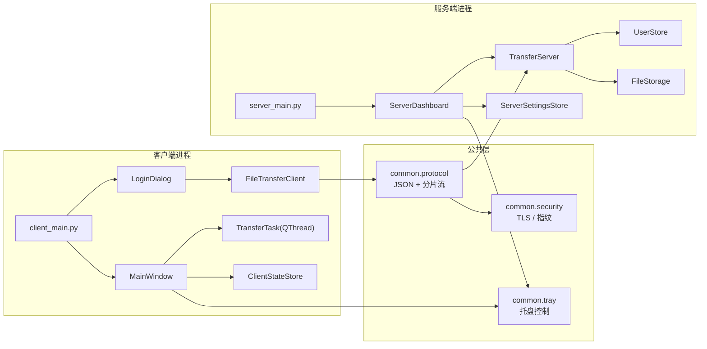
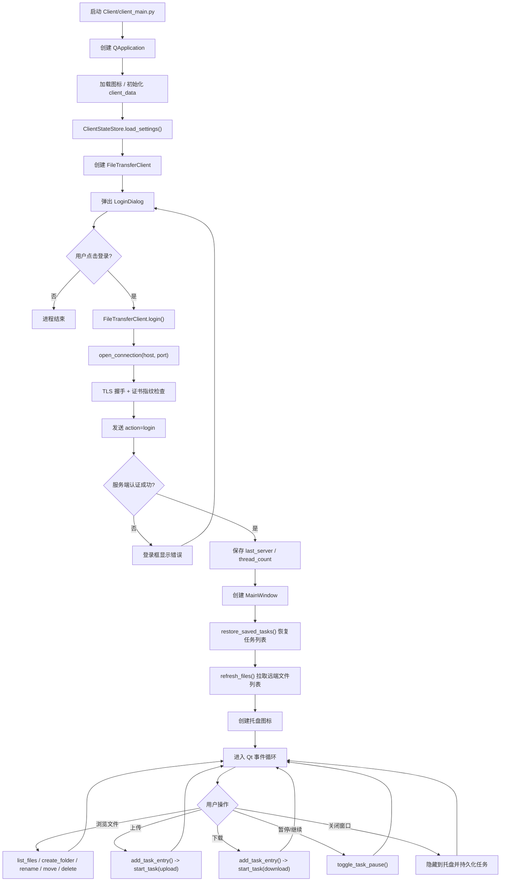
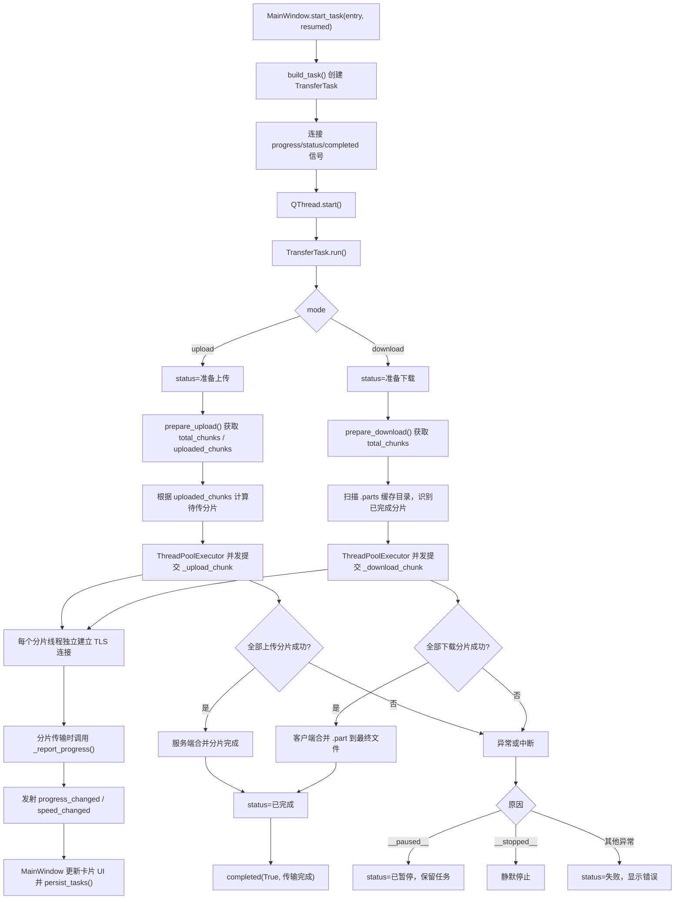
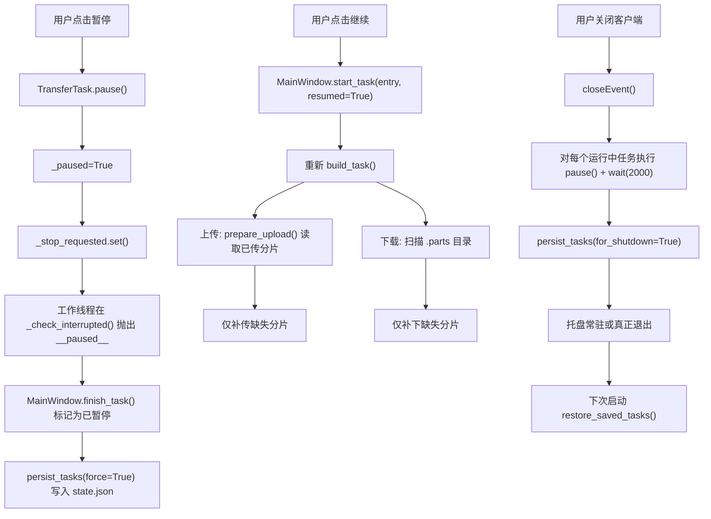
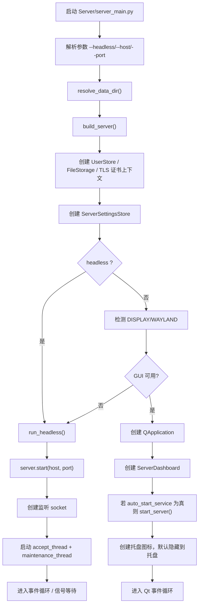
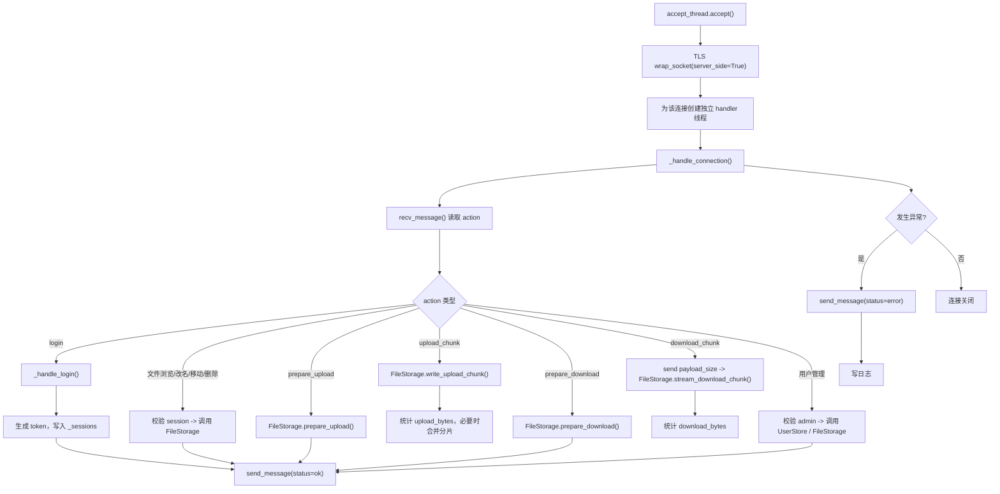
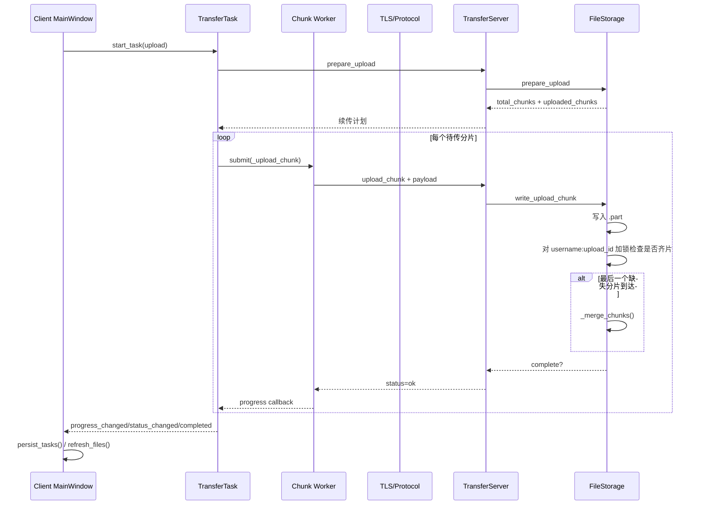
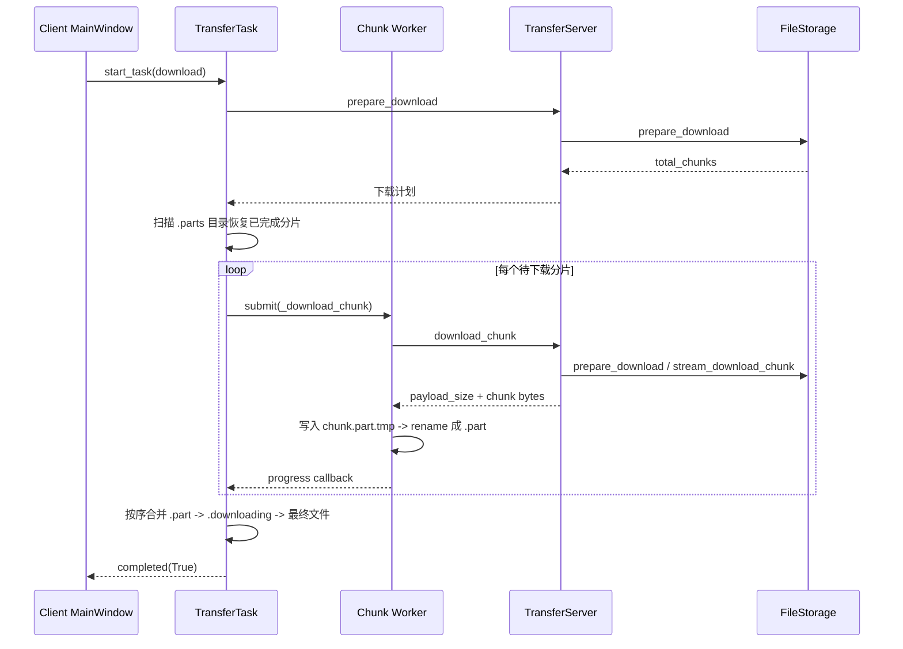

# TCPTransGUI 程序流程图

本文档给出客户端、服务端的完整运行流程，并补充线程模型、锁的使用说明与并发边界。

## 1. 总体结构

## 2. 客户端主流程

## 3. 客户端传输任务流程

### 3.1 上传 / 下载任务统一流程

### 3.2 暂停 / 恢复 / 关闭恢复

## 4. 服务端主流程

## 5. 服务端请求处理流程

## 6. 锁与并发模型说明

### 6.1 客户端锁

| 位置 | 类型 | 保护对象 | 何时加锁 | 说明 |
|---|---|---|---|---|
| `ClientStateStore._lock` | `threading.RLock` | `state.json` 对应的内存状态 `_state` | `load_settings/save_settings/load_tasks/save_tasks/load_server_fingerprint/save_server_fingerprint` | 防止 UI 线程与任务回调同时读写客户端状态文件。使用 `RLock` 是因为 `save_settings()` 内部会再次调用 `load_settings()`。 |
| `TransferTask._progress_lock` | `threading.Lock` | `completed_bytes`、`_last_emit`、瞬时速度计算 | 多个分片线程同时回报进度时 | 上传/下载使用 `ThreadPoolExecutor` 并发分片，没有这把锁会导致进度、速度重复累计或跳变。 |
| `TransferTask._stop_requested` | `threading.Event` | 暂停/停止标记 | `pause()/stop()/run()` 期间 | 这不是锁，但承担跨线程中断协调职责。工作线程会在 `_check_interrupted()` 中读取。 |

### 6.2 服务端锁

| 位置 | 类型 | 保护对象 | 何时加锁 | 说明 |
|---|---|---|---|---|
| `TransferServer._state_lock` | `threading.RLock` | `_running`、`_server_socket`、`_sessions`、`_stats` | `start/stop/is_running/current_stats/_handle_login/_require_session/_bump_stat/_emit_sessions/update_user/purge_expired_users` | 服务端存在 accept 线程、maintenance 线程、多个连接处理线程和 GUI 线程，所有运行态共享状态都由这把锁保护。 |
| `UserStore.lock` | `threading.RLock` | `_data["users"]` 与 `users.json` | 用户查询、登录校验、增删改、到期清理 | 防止管理员操作、登录线程、维护线程同时修改用户数据。使用 `RLock` 便于内部嵌套调用。 |
| `ServerSettingsStore._lock` | `threading.RLock` | `_settings` 与 `settings.json` | GUI 改 host/port/auto_start 时 | 保护服务端设置持久化，避免界面多个信号连续触发时写坏配置。 |
| `FileStorage._locks[username:upload_id]` | `threading.Lock` | 单个上传会话的分片合并阶段 | `write_upload_chunk()` 检查“所有分片是否齐全”并 `_merge_chunks()` 时 | 分片上传是并发的，多条上传线程可能几乎同时写完最后几个分片；这把锁保证同一 `upload_id` 只会触发一次合并。 |

### 6.3 哪些地方没有显式锁

- `MainWindow` 大部分状态更新没有显式锁，因为 Qt Widget 只能在 GUI 主线程操作。
- `FileStorage` 的普通文件列表、目录创建、重命名、移动、删除没有额外全局锁，依赖操作系统文件系统原子性与“单个请求单线程处理”模型。
- `common.protocol` 与 `common.security` 没有共享可变状态，因此不需要锁。

## 7. 关键并发边界

### 7.1 客户端

1. `MainWindow` 运行在 Qt 主线程。
2. 每个 `TransferTask` 是一个 `QThread`。
3. 每个 `TransferTask` 内部又会创建 `ThreadPoolExecutor`，并发处理多个分片。
4. 分片线程不直接操作 UI，只通过 `pyqtSignal` 回到主线程更新界面。

### 7.2 服务端

1. 主监听线程负责 `accept()`。
2. 每个 TCP 连接会派生一个处理线程。
3. 后台 `maintenance_thread` 每 60 秒清理一次过期临时用户。
4. 若存在 GUI，`ServerDashboard` 通过 Qt 信号接收运行状态变更。

## 8. 一次完整上传的时序图

## 9. 一次完整下载的时序图

## 10. 阅读建议

若要沿代码继续跟踪，建议按这个顺序看：

1. 客户端入口：`Client/client_main.py`
2. 客户端主窗：`Client/src/ui/main_window.py`
3. 传输线程：`Client/src/core/transfer.py`
4. 服务端入口：`Server/server_main.py`
5. 服务端核心：`Server/src/core/server.py`
6. 用户与文件层：`Server/src/core/auth.py`、`Server/src/core/file_manager.py`
7. 状态持久化：`Client/src/core/state_store.py`、`Server/src/core/settings_store.py`
